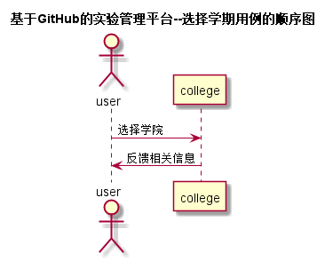

# “学院列表”用例 [返回](./README.md)
## 1. 用例规约
|用例名称|学院列表|
|-------|:-------------|
|功能|选择学院|
|参与者|学生，老师|
|前置条件|学生，老师登录后在学生列表中可选择|
|后置条件| |
|主流事件| |
|备注| |

## 2. 业务流程（顺序图） [源码](../src/选择学院.puml)
 

## 3. 界面设计
- 界面参照:
- API接口调用
         - 接口1：[getProfessional](../接口/getProfessional.md) 

## 4. 算法描述（活动图）
    无
## 5. 参照表

