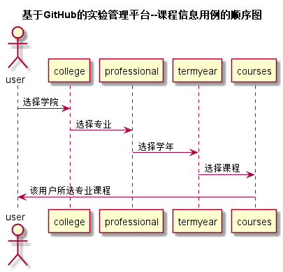

# “课程列表”用例 [返回](./README.md)
## 1. 用例规约
|用例名称|选择学期|
|-------|:-------------|
|功能|用户登录之后需要选择|
|参与者|学生，老师|
|前置条件|学生，老师登陆后先选择学院专业，学年|
|后置条件| 选完前几步后出现正确的课程信息|
|主流事件| |
|备注| |

## 2. 业务流程（顺序图） [源码](../src/课程信息.puml)
 

## 3. 界面设计
- 界面参照: https://huangyihuan11.github.io/is_analysis/test6/ui/评定成绩.html
- 接口：[getCourses](../接口/getCourses.md)

## 4. 算法描述（活动图）
无

## 5. 参照表
- [STUDENTS](../数据库设计.md/#STUDENTS)
- [TEACHERS](../数据库设计.md/#TEACHERS)
- [COURSES](../数据库设计.md/#COURSES)

