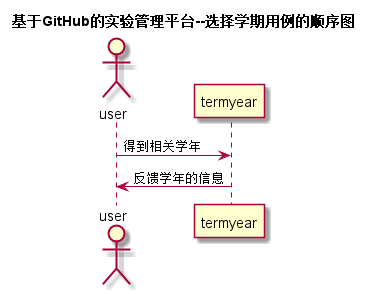

# “选择学期”用例 [返回](./README.md)
## 1. 用例规约
|用例名称|选择学期|
|-------|:-------------|
|功能|选择学年|
|参与者|学生，老师|
|前置条件|学生，老师登录后在学生列表中可选择|
|后置条件| |
|主流事件| |
|备注| |

## 2. 业务流程（顺序图） [源码](../src/选择学年.puml)
 

## 3. 界面设计
- 界面参照:
- API接口调用
         - 接口1：[getTerms-year](../接口/getTerms-year.md) 

## 4. 算法描述（活动图）
    无
## 5. 参照表
- [STUDENTS](../数据库设计.md/#STUDENTS)
- [TEACHERS](../数据库设计.md/#TEACHERS)
- [TERMS](../数据库设计.md/#TERMS)

